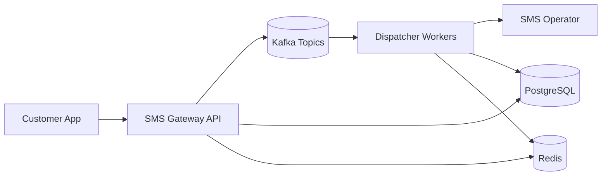
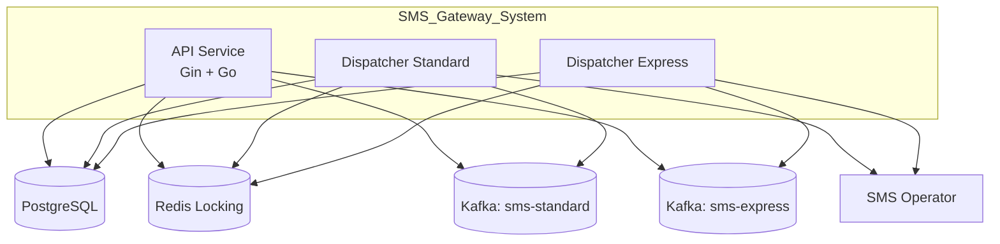
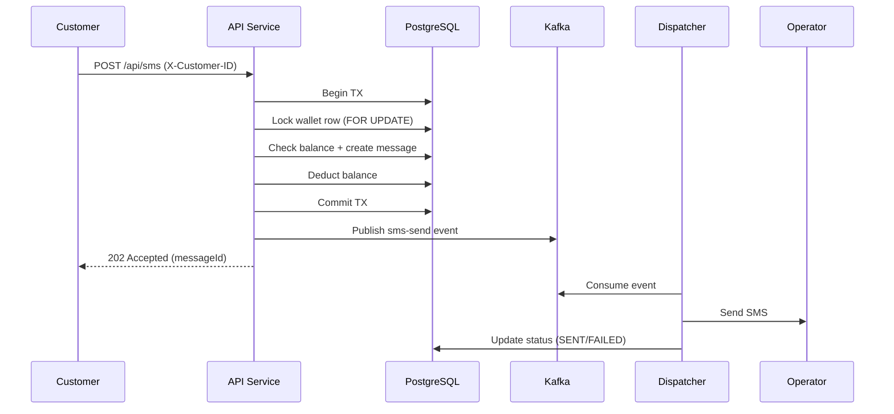

# SMS Gateway System - Architecture

## Goals

- Handle very high throughput (up to 100M SMS/day).
- Support uneven customer traffic distribution.
- Provide express delivery path with a defined SLA.
- Enforce strict wallet balance rules.
- Offer detailed reporting for customers.

## Context Diagram

## Container Diagram

## Sequence Diagram - Send SMS

## Key Design Decisions

- **Wallet enforcement**: balance check and deduction are done in a single database transaction with row-level locking to prevent overspending.
- **Express path**: express messages go to a dedicated Kafka topic and dispatcher pool to reduce queueing delay.
- **Partitioning**: Kafka message key is `customer_id` to preserve per-customer ordering while allowing horizontal scaling.
- **Redis locks**: prevent duplicate processing when events are retried or re-delivered.
- **SLA**: express SLA is measured from message acceptance time to operator send time. Breaches are flagged.

## Scaling Notes

- Increase Kafka partitions and dispatcher replicas to handle higher throughput.
- Use separate dispatcher deployments for express and standard.
- Add a dedicated outbox relay if exactly-once publication is required.
